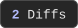
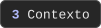
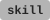
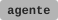
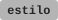
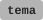

# claude-code-kit



[](plugins/csr-cockpit/)
[](#catálogo)
[](https://code.claude.com/docs)
[](LICENSE)
[](https://blog.cesarschutz.com.br)

Caixa de ferramentas para o [Claude Code](https://code.claude.com/docs): mods, skills, agentes,
hooks, estilos de saída e temas, instaláveis um a um.

Este repositório é um marketplace de plugins. Você o cadastra uma vez e instala só o que quiser,
pelo nome. Não há build nem dependência: cada item é uma pasta de arquivos que o Claude Code lê
direto.

## Começar

Cadastre o marketplace:

```bash
claude plugin marketplace add cesarschutz/claude-code-kit
```

Instale um item pelo nome:

```bash
claude plugin install csr-cockpit@cesarschutz
```

> [!TIP]
> Dentro de uma sessão no terminal, `/plugin` mostra o catálogo e instala por ali. O que for
> instalado com a sessão aberta entra com `/reload-plugins`.

## Catálogo

### Ferramentas

#### [csr-cockpit](plugins/csr-cockpit/)

 Um painel ao lado da conversa com os instrumentos da sessão, em cinco abas: subagentes, diffs do
turno, uso do contexto e custo, arquivos lidos e comandos executados, e o histórico dos turnos. Uma
linha acima do prompt resume contexto, custo, limite de uso e agentes. Clicar no nome de um agente,
de um comando ou de um turno abre o detalhe: o pedido, as chamadas e a resposta. O mod só observa:
não bloqueia nem altera nenhuma chamada de ferramenta.

<a href="plugins/csr-cockpit/"></a>

<a href="plugins/csr-cockpit/README.md#1-agentes"></a>
<a href="plugins/csr-cockpit/README.md#2-diffs"></a>
<a href="plugins/csr-cockpit/README.md#3-contexto"></a>
<a href="plugins/csr-cockpit/README.md#4-arquivos"></a>
<a href="plugins/csr-cockpit/README.md#5-turnos"></a>

```bash
claude plugin install csr-cockpit@cesarschutz
```

Abre e fecha com `/cockpit`. Pede o Claude Code 2.1.287 ou mais novo. Detalhes, teclas e limites
no [README do csr-cockpit](plugins/csr-cockpit/).

### [csr-reviewer](plugins/csr-reviewer/)

 Um segundo par de olhos para a sessão. Depois que o agente principal conclui um turno, cria um fork somente-leitura da própria conversa, procura riscos ou pontos esquecidos e mostra os achados num painel lateral sem poluir o transcript principal.

```bash
claude plugin install csr-reviewer@cesarschutz
```

Abre e fecha com `/reviewer`. A revisão automática pode ser ligada ou pausada com `/reviewer on` e `/reviewer off`; `/reviewer run` força uma revisão manual. O painel mostra também os tokens usados pelo fork.

### Exemplos

Peças pequenas, uma de cada tipo, para aprender o formato ou copiar como ponto de partida. Cada
uma instala sozinha.

| Item | Tipo | O que faz |
|---|---|---|
| [`mensagem-de-commit`](skills/mensagem-de-commit/SKILL.md) |  | Escreve a mensagem de commit para o que está no stage, sem commitar |
| [`explicar-erro`](skills/explicar-erro/SKILL.md) |  | Explica um erro ou stack trace e aponta a causa provável |
| [`pesquisador`](agents/pesquisador.md) |  | Localiza no código onde algo é feito e devolve um mapa; só lê |
| [`critico`](agents/critico.md) |  | Dá uma segunda opinião sobre um plano, procurando o que pode dar errado; só lê |
| [`professor`](output-styles/professor.md) |  | Explica o porquê de cada passo, para quem está aprendendo |
| [`tinta-azul`](themes/tinta-azul/themes/tinta-azul.json) |  | Cores do terminal com o destaque em azul |
| [`responder-em-portugues`](hooks/responder-em-portugues/) |  | No início da sessão, pede ao Claude que responda em português |
| [`exemplos`](plugins/exemplos/) |  | Skill, agente, hook e estilo de saída num plugin só |

```bash
claude plugin install explicar-erro@cesarschutz
```

## O que é cada tipo

| Tipo | O que é | Como age depois de instalado |
|:--|---|---|
|  | Instruções em Markdown para uma tarefa | O Claude usa quando o pedido combina, ou você chama pelo menu de `/` |
|  | Um ajudante com papel próprio e ferramentas limitadas | O Claude delega a ele, ou você pede pelo nome |
|  | Um comando ligado a um evento da sessão | Roda sozinho no evento |
|  | Um jeito de responder: o estilo de saída | Você escolhe em `/output-style` |
|  | Cores do terminal | Você escolhe em `/theme` |
|  | Código que roda dentro do Claude Code e desenha na interface | Acrescenta painéis, comandos e linhas na tela |
|  | Um plugin com várias peças | Tudo o que está dentro vem junto |

Cada linha do catálogo é instalada inteira e separada das outras. Uma peça avulsa traz só ela; um
pacote traz todas as suas peças de uma vez.

## Antes de instalar

> [!IMPORTANT]
> Skills, agentes, estilos e temas são texto. Hooks e mods executam na sua máquina, com as suas
> permissões. Leia o que vai instalar: os arquivos são curtos.

Para um mod, o próprio Claude Code lista os eventos que ele observa e o que ele chama, sem
executá-lo:

```bash
git clone https://github.com/cesarschutz/claude-code-kit.git
```

```bash
claude plugin validate ./claude-code-kit/plugins/csr-cockpit
```

## Atualizar e remover

```bash
claude plugin update csr-cockpit@cesarschutz
```

```bash
claude plugin uninstall csr-cockpit@cesarschutz
```

## Requisitos

- Claude Code. Os mods pedem a versão 2.1.287 ou mais nova (`claude --version`).
- A instalação de cada item foi conferida no Claude Code para terminal. O que cada tipo carrega
  em outros aplicativos está na
  [tabela de suporte por plataforma](https://claude.com/docs/plugins/platform-support).

## Estrutura do repositório

```
.claude-plugin/marketplace.json   o catálogo
plugins/                          plugins completos, cada um com o seu manifesto
skills/                           skills avulsas
agents/                           agentes avulsos
output-styles/                    estilos de saída avulsos
themes/                           temas avulsos
hooks/                            hooks avulsos
docs/                             imagens dos READMEs (arte em SVG e prints)
scripts/arte.py                   gera a arte em docs/arte/ a partir do catálogo
```

Para acrescentar um item ou propor uma mudança, veja o [CONTRIBUTING.md](CONTRIBUTING.md).

## Licença

[MIT](LICENSE) © Cesar Schutz
