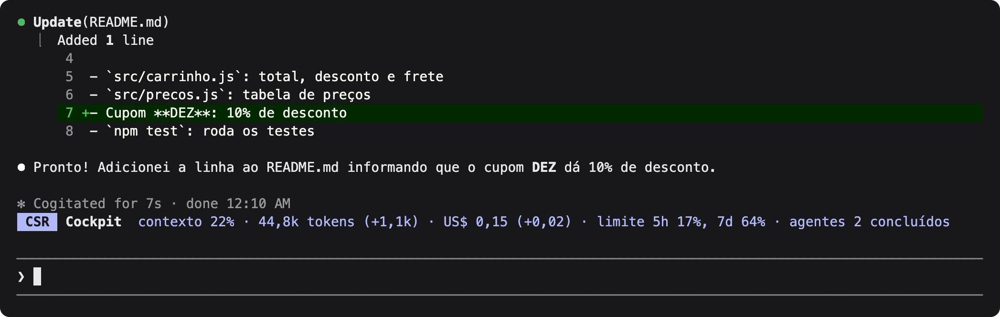
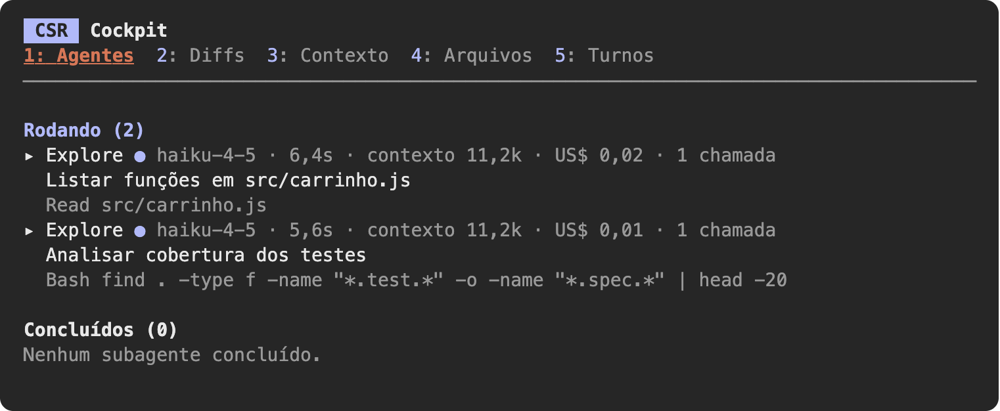
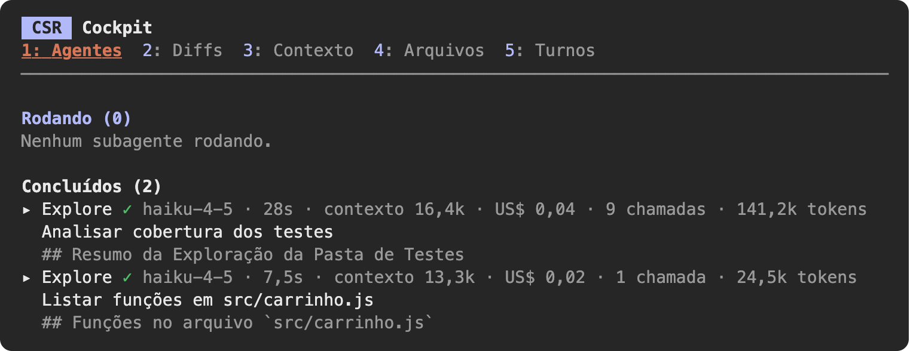
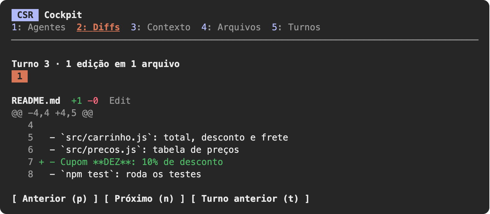
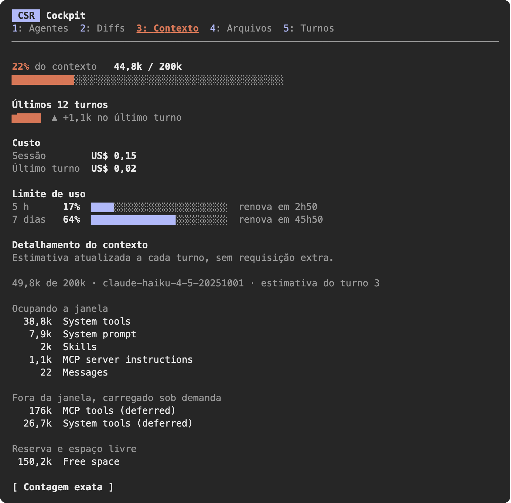
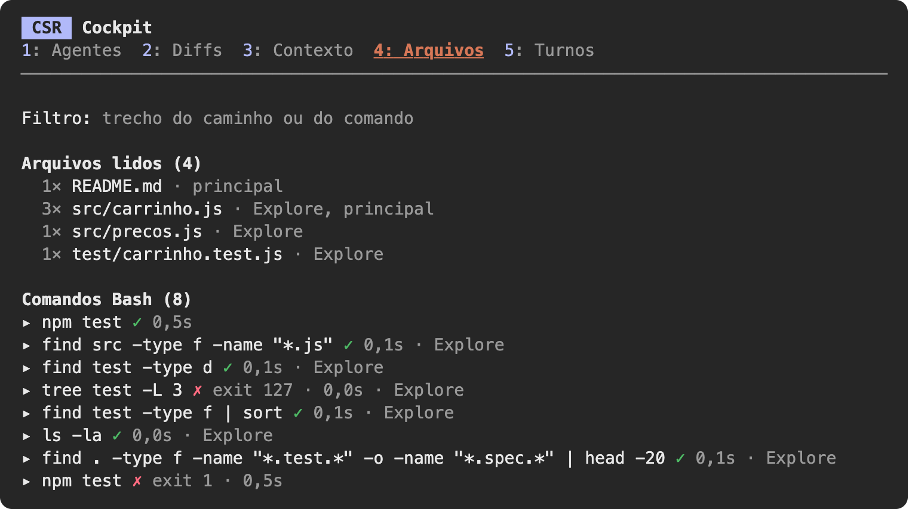
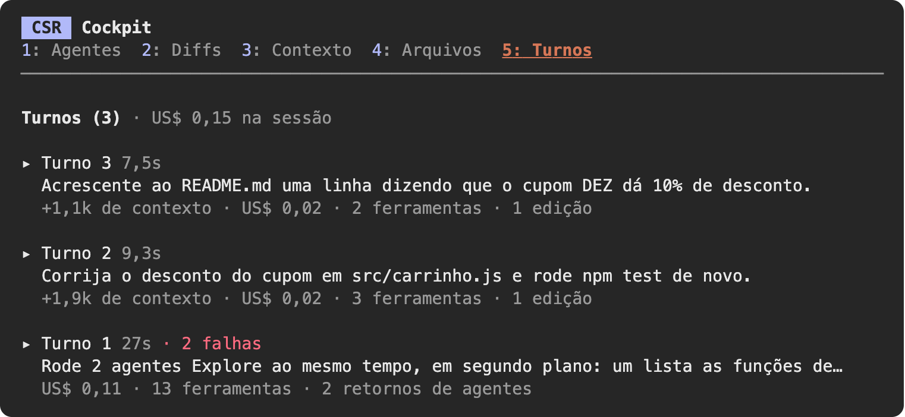
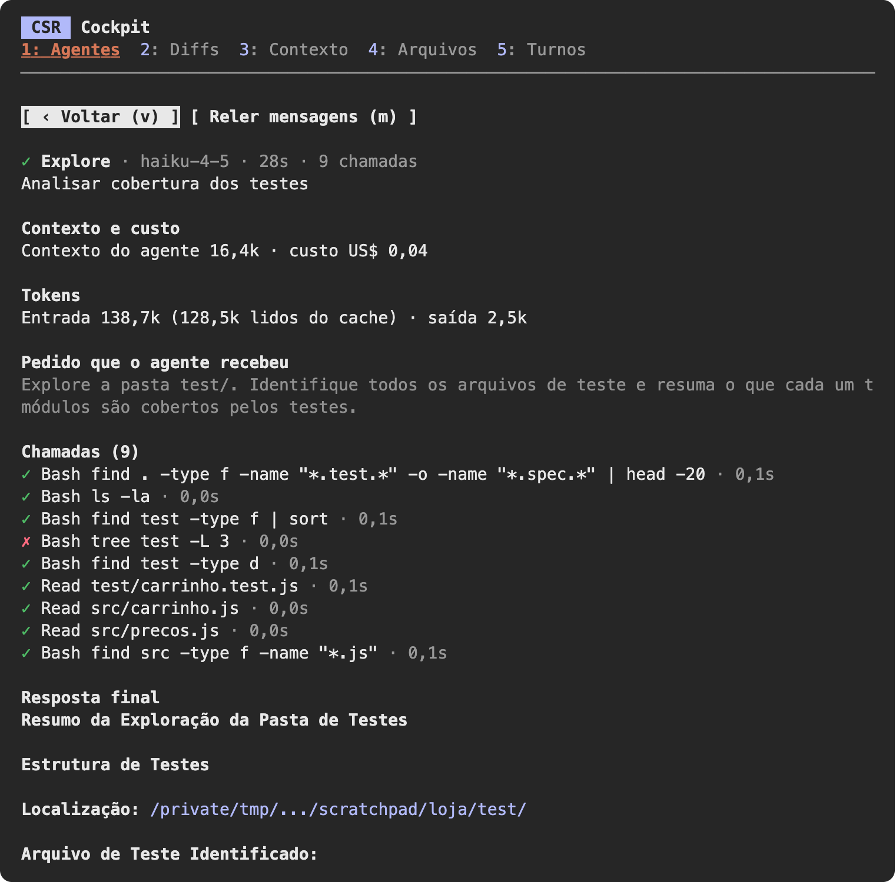

# csr-cockpit


[](.claude-plugin/plugin.json)
[](https://code.claude.com/docs)
[](../../LICENSE)

Um painel ao lado da conversa do Claude Code, com os instrumentos da sessão: o que os subagentes
estão fazendo, o que foi editado, quanto do contexto já foi usado e quais arquivos e comandos
passaram por ali. Mais uma linha de resumo acima do prompt.

> [!NOTE]
> O csr-cockpit só observa. Nenhum dos seus hooks bloqueia, altera ou segura uma chamada de
> ferramenta nem uma resposta do modelo: todos repassam o que receberam e devolvem o resultado
> como veio.

O desenho do topo é uma ilustração da tela. Os prints das abas, mais abaixo, vêm de uma sessão
real no terminal (Claude Code 2.1.287, modelo Haiku 4.5), num projeto de exemplo.

## Requisitos

- Claude Code 2.1.287 ou mais novo (`claude --version`). O app Desktop traz a própria cópia do
  Claude Code: atualize o app também.
- O painel é desenhado no terminal e na aba Code do app Desktop. Na extensão do VS Code e em
  `claude -p`, os dados são registrados, mas nada é desenhado.

## Instalar

```bash
claude plugin marketplace add cesarschutz/claude-code-kit
```

```bash
claude plugin install csr-cockpit@cesarschutz
```

## Usar

| Tecla ou comando | O que faz |
|---|---|
| `/cockpit` | Abre e fecha o painel |
| <kbd>Esc</kbd> | Fecha o painel |
| <kbd>1</kbd> a <kbd>5</kbd> | Trocam de aba, com o painel em foco |
| <kbd>p</kbd> <kbd>n</kbd> | Diff anterior e próximo (aba Diffs) |
| <kbd>t</kbd> | Turno anterior (aba Diffs) |
| `▸ nome` | Abre o detalhe de um agente, de um comando ou de um turno (clique no nome, ou <kbd>Tab</kbd> até ele e <kbd>Enter</kbd>) |
| <kbd>v</kbd> | Volta do detalhe para a lista |
| <kbd>m</kbd> | No detalhe de um agente, relê as mensagens dele |

Os dados são registrados desde o início da sessão, com o painel aberto ou fechado. Se o painel
não tiver lugar ao lado da conversa, aparece uma versão compacta acima do prompt, com as mesmas
abas.

## A linha de resumo

Fica acima do prompt o tempo todo, com o painel aberto ou fechado:



| Parte | O que diz |
|---|---|
| `contexto 22%` | Quanto da janela de contexto está ocupado |
| `44,8k tokens (+1,1k)` | Tokens no contexto agora e, entre parênteses, o que o último turno somou |
| `US$ 0,15 (+0,02)` | Custo da sessão e, entre parênteses, o do último turno |
| `limite 5h 17%, 7d 64%` | Uso de cada janela do limite da conta |
| `agentes 2 concluídos` | Subagentes rodando e concluídos |

O "último turno" conta do seu último pedido até agora, com os retornos de agentes em segundo
plano incluídos. Os parênteses somem quando não houve mudança.

## As abas

<a href="#1-agentes"></a>
<a href="#2-diffs"></a>
<a href="#3-contexto"></a>
<a href="#4-arquivos"></a>
<a href="#5-turnos"></a>

### 1 Agentes

*Quem está trabalhando agora, e em quê?*

Subagentes rodando e concluídos, com contagem. Para cada um: tipo, modelo, tempo decorrido, o
tamanho do contexto do próprio agente, quanto ele custou, o número de chamadas, a tarefa que
recebeu e a atividade atual (última ferramenta e argumento). Nos concluídos, a duração, o total de
tokens e a primeira linha do resultado.





### 2 Diffs

*O que mudou neste turno?*

Cada Edit e Write do loop principal, agrupado por turno (os últimos 10). Um diff por vez, com
número de linha, caminho do arquivo e contagem de linhas que entraram e saíram. No Write sobre um
arquivo que já existia, o conteúdo antigo é lido antes da escrita, para o diff ser o real.



### 3 Contexto

*Quanto do contexto sobra, e quanto já custou?*

Percentual usado, tokens sobre a janela, gráfico dos últimos 12 turnos e quanto o último turno
acrescentou. Custo da sessão e do último turno, e o limite de uso com o horário de renovação.
Abaixo, o detalhamento por categoria (sistema, ferramentas, memória, conversa): uma estimativa
local, atualizada a cada turno, sem requisição extra. O botão "Contagem exata" troca a estimativa
pela contagem de verdade, que faz uma requisição por ferramenta e por arquivo de memória; por isso
só acontece quando é apertado.



### 4 Arquivos

*O que foi lido e rodado, e por quem?*

Arquivos lidos (caminho, quantas vezes e por quem) e comandos Bash (status, exit code, duração e
quem rodou), com um campo de filtro. A pasta do projeto some dos comandos mostrados
(`find /pasta/do/projeto/src` aparece como `find src`); o detalhe traz o comando inteiro.



### 5 Turnos

*O que aconteceu, na ordem?*

Um registro por turno da conversa, do mais recente ao mais antigo: o começo do pedido, a duração,
quanto o turno somou ao contexto, quanto custou, quantas ferramentas foram chamadas, quantas
falharam e quantas edições houve. No alto, o custo total da sessão. O turno em curso aparece em
andamento.



## Detalhes

Nas abas Agentes, Arquivos e Turnos, o nome no começo de cada linha (`▸ Explore`, `▸ Turno 3`) é
clicável e abre o detalhe do item no lugar da lista. Com o mouse sobre a linha, o nome fica
sublinhado.

- **Agente.** O contexto e o custo dele, os tokens de entrada e de saída, o pedido que recebeu,
  as últimas 40 chamadas de ferramenta com status e duração, o que ele escreveu ao longo do
  trabalho (lido da transcrição dele ao abrir e no botão "Reler mensagens") e a resposta final.
- **Comando.** O comando inteiro, a descrição, o fim da saída e o erro.
- **Turno.** O pedido e a resposta inteiros, quantas vezes cada ferramenta foi chamada e, quando
  houve agentes em segundo plano, o que o Claude respondeu depois do retorno de cada um.



### Turnos agrupados

Quando um agente em segundo plano termina, o Claude Code abre um turno sozinho para tratar o
retorno. A aba Turnos junta esses turnos automáticos ao pedido que os gerou: um pedido seu é um
turno na lista, com a duração, o custo e as ferramentas de tudo o que ele desencadeou. As edições
feitas nesses retornos entram nos diffs do mesmo turno.

### Custo e contexto de cada agente

O Claude Code informa o custo da sessão inteira, não o de cada subagente. O csr-cockpit reparte
esse custo: ao fim de cada resposta do modelo, o que o custo da sessão subiu vai para quem fez a
resposta. A soma bate com o total da sessão; se duas respostas terminam no mesmo instante, uma
fração pode cair no agente vizinho. O "contexto" de um agente é o tamanho do contexto dele na
última resposta. Ele tem uma janela própria, que não ocupa a da conversa principal.

## Limites conhecidos

- **Exit code do Bash.** O resultado da ferramenta não traz o código como campo. Em falha, ele é
  lido do texto de erro; em sucesso, a linha mostra só a marca de concluído e a duração.
- **Comando em segundo plano.** A chamada volta na hora; o fim real não chega ao mod. A linha fica
  como "em segundo plano".
- **Versão compacta.** `Esc` não a fecha; use `/cockpit` ou o botão Fechar.
- **Tamanho.** Guarda 100 agentes, 300 arquivos, 100 comandos, 60 turnos, 10 turnos de diffs com
  60 edições cada e 400 linhas por diff.
- **Linha de resumo.** Fica na faixa acima do prompt, em azul, e só aparece quando há leitura
  (depois da primeira resposta do modelo). O mod não usa a status line do Claude Code, que sai
  sempre em amarelo com um ícone de aviso.
- **`/cockpit` não escreve nada na conversa.** O texto de saída de um comando entra no que o
  modelo lê; abrir e fechar o painel não devolvem texto.
- **Custo por agente.** É uma repartição do custo da sessão, não um valor informado pelo Claude
  Code (veja "Custo e contexto de cada agente"). Onde a sessão não tem custo, a linha mostra só o
  contexto e os tokens.
- **Primeiro turno.** Não mostra quanto somou ao contexto: antes da primeira resposta do modelo
  ainda não há medida de onde partir.
- **Mensagens do agente.** Não são ao vivo: são relidas ao abrir o detalhe e no botão. O
  raciocínio interno do agente não vem na transcrição; só o texto que ele escreveu.
- **API em evolução.** A API de mods pode mudar entre versões do Claude Code. Este mod foi
  testado na 2.1.287, no terminal. No app Desktop, o desenho do painel ainda não foi conferido.

## Privacidade

O csr-cockpit não faz chamada de rede nem grava arquivo. O que ele registra fica no estado da
sessão, na memória do Claude Code, e some com ela: caminhos de arquivos, comandos e o fim da saída
deles, diffs, o pedido e a resposta de cada turno, e o pedido, as chamadas e o resultado de cada
subagente. Para conferir o que o mod chama antes de instalar, clone o
repositório e rode:

```bash
claude plugin validate ./plugins/csr-cockpit
```

## Desenvolver

```bash
claude --plugin-dir ./plugins/csr-cockpit
```

```bash
claude plugin validate ./plugins/csr-cockpit --strict
```

```bash
claude plugin test ./plugins/csr-cockpit
```

Os testes rodam cada aba e cada detalhe nas superfícies `terminal` e `desktop`, além da linha de
resumo. A pasta
`.claude-plugin/types/` é escrita pelo Claude Code ao carregar o mod e não vai para o git.

```
.claude-plugin/plugin.json   manifesto
hooks/hooks.json             aponta o módulo
hooks/register.tsx           hooks, comando /cockpit e ações dos botões
hooks/dados.ts               transformações do estado
hooks/diff.ts                diff por linhas
hooks/formato.ts             números, durações e barras em pt-BR
hooks/telas.tsx              desenho das cinco abas
hooks/fichas.tsx             detalhe de agente, comando e turno
types/index.d.ts             contrato do estado
tests/                       testes
```
